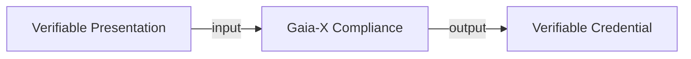

# 1. Overview
Slides are available at: https://gitlab.com/gaia-x/gaia-x-community/gx-hackathon/gx-hackathon-5/-/wikis/home

GAIA-X Architecture: https://gaia-x.gitlab.io/technical-committee/architecture-document/, old: https://docs.gaia-x.eu/technical-committee/architecture-document/21.03/ecosystem/

Gitlab GX FS: https://gitlab.com/gaia-x/data-infrastructure-federation-services

# 2. Self-descriptions - Trust Framework

https://gaia-x.eu/news/latest-news/gaia-x-compliance-service-deployment-scenario/
https://gitlab.com/gaia-x/policy-rules-committee

Insights: For a self-description - one needs a certificate with full trust chain, no self-signed certificate
For download of a full trust chain and certificate, recommended to use: https://whatsmychaincert.com/

SHACL - Shapes Constraint Language - https://www.w3.org/TR/shacl/
GX Registry shapes: https://gitlab.com/gaia-x/lab/compliance/gx-registry/-/blob/2206-main/src/static/shapes/v2206/

Example of self-descriptions: https://gitlab.com/gaia-x/gaia-x-community/gx-hackathon/gx-hackathon-5/-/tree/main/

Self=description signer -generate signed .json and .did file: https://github.com/deltaDAO/self-description-signer, https://github.com/deltaDAO/self-description-signer/blob/main/config/self-description.json

Verifiable Credentials context: https://www.w3.org/TR/vc-data-model/#contexts

Self-description creation wizard: https://sd-creation-wizard.gxfs.dev/

## Compliance service
Overview: https://compliance.gaia-x.eu/guide/gaia-x-trust-framework.html#overview
Code: https://gitlab.com/gaia-x/lab/compliance/gx-compliance

The Gaia-X Compliance service

Documentation: https://gitlab.com/gaia-x/technical-committee/federation-services/self-description-model/-/blob/main/docs/compliance.md

How to setup certificates: https://gitlab.com/gaia-x/lab/compliance/gx-compliance#how-to-setup-certificates

API: current version 22.06: https://compliance.gaia-x.eu/v2206/docs/#/

## Registry service
API:https://registry.gaia-x.eu/v2206/docs/#/

# 3. EDC - Minimal viable Demonstrator (MVD)

Slides: https://onedrive.live.com/view.aspx?resid=9C2CEFE97D71D1AC!75668&ithint=file%2cpptx&authkey=!AMT6p1TJBEFBSmw

How to test/setup: https://github.com/eclipse-dataspaceconnector/MinimumViableDataspace/tree/main/system-tests

Data Dashboard (dev frontend of the connector): https://github.com/eclipse-dataspaceconnector/DataDashboard

# 4. MoveID
MVG Portal: https://portal.minimal-gaia-x.eu/
https://portal.minimal-gaia-x.eu/asset/did:op:87152E582e3B05Cc6940E9763b9e0c22eA812448

# 5. From other sessions:

Self-description wizard: https://gitlab.com/gaia-x/data-infrastructure-federation-services/self-description-tooling/sd-creation-wizard

Sovereign Cloud Stack (OpenStack, Terraform, Kubernetes): https://github.com/SovereignCloudStack

Minimal viable GAIA-X https://github.com/deltaDAO/mvg-portal

Questions: how do Self-descriptions link to IAM components: do the certificates get generated by IAM or authentication is via the Self-description?
